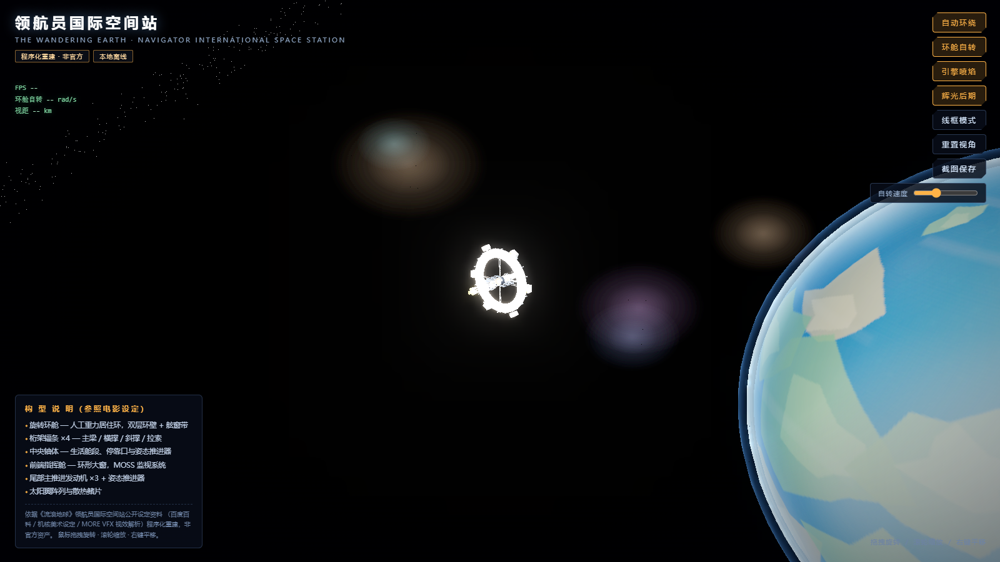

# 流浪地球 · 领航员国际空间站（本地离线 3D 展示）



参照《流浪地球》领航员国际空间站公开设定资料，用 Three.js 程序化重建的三维模型。
**纯本地运行，无需联网、无需服务器**，双击 HTML 文件即可在浏览器中查看。

- **许可证**：[MIT](./LICENSE)
- **在线 Demo**：推送到 GitHub 并启用 Pages 后，访问 `https://<用户名>.github.io/<仓库名>/`（见下方"部署到 GitHub Pages"）

## 如何查看

| 文件 | 说明 |
| --- | --- |
| `index.html` | 标准版入口（依赖 `lib/` 与 `app.js`），**双击打开** |
| `standalone.html` | 单文件版（全部库已内联，约 690KB），可单独拷贝/分享 |
| `preview.png` | 渲染效果预览图 |

浏览器要求支持 WebGL（Chrome / Edge / Firefox / Safari 均可）。

## 依据的设定资料

- [百度百科：领航员国际空间站](https://baike.baidu.com/item/%E9%A2%86%E8%88%AA%E5%91%98%E5%9B%BD%E9%99%85%E7%A9%BA%E9%97%B4%E7%AB%99/23569815)
- [机核 GCORES：电影《流浪地球2》超详细美术设定"月球/空间站"篇](https://www.gcores.com/articles/161729)
- [MORE VFX《流浪地球》视效解析](https://cinehello.com/articles/220221)
- [《流浪地球》中被烧毁的空间站为啥是圆盘状（结构分析）](https://www.sohu.com/a/294104619_381442)
- [流浪地球中的空间站为什么像个大轮子（人工重力分析）](https://zhishifenzi.com/news/astronomy/5210.html)

## 模型构型（对照电影设定）

- **旋转环舱**：双层环壁（外环盖板 + 内环骨架），外表面舷窗带（发光）、
  竖向加强筋 ×20、外挂居住舱 ×6（含舷窗与橙色饰条）、环上小天线 ×3
- **桁架辐条 ×4**：双主梁 + 横撑 + 交替斜撑 + 对角拉索
- **中央轴体**：分段环、橙黑警示环、停靠环（含对接块）、姿态推进器、
  中文标识带（"领航员国际空间站 · UEG"）
- **前端指挥舱**：过渡锥台、环形大窗（发光）、前鼻锥、**MOSS 监视塔（红眼闪烁）**、碟形天线
- **尾部推进**：发动机舱 + 散热鳍片 + 主发动机 ×3（喷焰 + 动态闪烁 + 点光源）+
  姿态推进器 ×6（微型喷焰）
- **太阳翼**：电池板栅格纹理 + 框架 + 连接桁

## 场景与后期

- 程序化地球（大陆/云层/双层大气辉光）、银河星盘、星云精灵、亮星
- UnrealBloomPass 辉光后期（舷窗、喷焰、警示灯发光）
- 开场电影感运镜（约 5 秒推近），环舱独立自转，站体缓慢环绕
- 遥测面板（FPS / 环舱转速 / 视距）

## 交互

鼠标左键拖拽旋转 · 滚轮缩放 · 右键平移；右上角按钮：自动环绕 / 环舱自转 /
引擎喷焰 / 辉光后期 / 线框模式 / 重置视角 / 截图保存 / 自转速度滑块。
调试特写：URL 追加 `?noIntro&pos=x,y,z` 可跳过运镜并直接设定视角。

## 目录结构

```
wandering-earth-station/
├── index.html          标准版入口
├── standalone.html     单文件版（可直接分享）
├── app.js              场景与模型代码（程序化构建，含程序化纹理）
├── lib/                three.js r128 UMD + OrbitControls + Bloom 后期库（全部本地）
├── .github/workflows/  GitHub Pages 自动部署工作流
├── LICENSE             MIT 许可证
├── preview.png         渲染预览
└── README.md
```

## 部署到 GitHub Pages

1. 在 GitHub 新建仓库（如 `wandering-earth-station`），将本目录全部文件上传或推送
2. 仓库 **Settings → Pages → Source** 选择 **GitHub Actions**
   （或直接推送 `main` 分支，`.github/workflows/pages.yml` 会自动构建部署）
3. 部署完成后访问 `https://<用户名>.github.io/<仓库名>/` 即可在线查看

## 说明

- 本项目为**非官方**的程序化重建，仅作学习与展示用途；电影资产版权归相关版权方所有。
- 全部资源本地化（three.js r128 UMD 版），断网可用。
